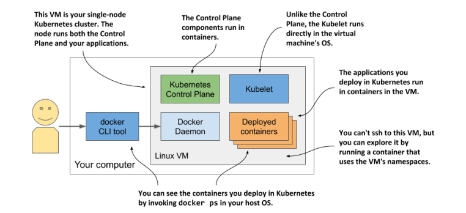
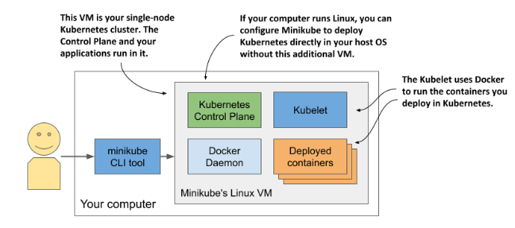
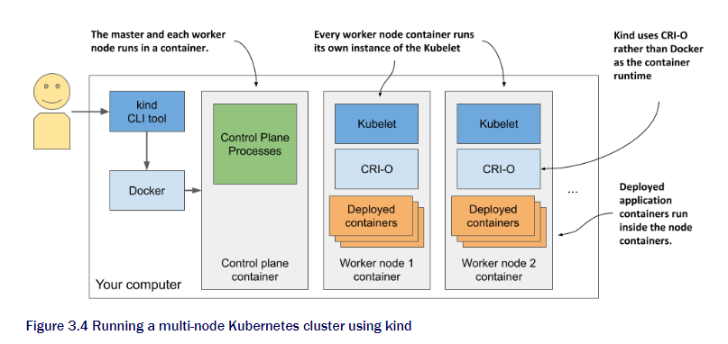

# chapter 3
## 3.1 Deploying kubernetes cluster
Setting up a full-fledged, multi-node kubernetes ain't easy.
Need to know Linux and network administration. Proper Kub install need multiple physical virtual machines and proper network

You can install k8s on laptop, organization infra, or virtual machine from cloud. Nowadays many cloud services provide Kub engine

### 3.1.1
You can start by just using docker desktop to run a single node k8s. Easiest way to start.

This is how the docker desktop runs kubernetes cluster.



DD sets up a virtual machine hosts the docker daemon and all the container.
In here runs the kubelet.(Kubernetes agents that manages the node)

To access the VM just need the docekr CLI

```shell
$ docker run --net=host --ipc=host --uts=host --pid=host --privileged \   --security-opt=seccomp=unconfined -it --rm -v /:/host alpine chroot /host 
```

Using this command you are in a shell that same as SSH.

Now you can try using [ps aux] to see the running container

### 3.1.2 MiniKube
You can also use Minikube.
This deploy the newer version of Kubernetes than the DD.
- single node
- suitable for testing and developong locally.

You can check the details from [Minikube repository](http://github.com/kubernetes/minikube)

For windows

<hr />

```shell
New-Item -Path 'c:\' -Name 'minikube' -ItemType Directory -Force
Invoke-WebRequest -OutFile 'c:\minikube\minikube.exe' -Uri 'https://github.com/kubernetes/minikube/releases/latest/download/minikube-windows-amd64.exe' -UseBasicParsing
```
Then add to PATH

```shell
$oldPath = [Environment]::GetEnvironmentVariable('Path', [EnvironmentVariableTarget]::Machine)
if ($oldPath.Split(';') -inotcontains 'C:\minikube'){
  [Environment]::SetEnvironmentVariable('Path', $('{0};C:\minikube' -f $oldPath), [EnvironmentVariableTarget]::Machine)
}
```

To start You simply need
```
minikube start
```

Here is the picture of how Minikube run locally


### 3.1.3 use *Kind*(Kubernetes in Docker) to run local cluster

Kind runs each cluster node inside a container. Instead of vm or host.
This can create multi-node clusters

Here is system outline


The process runs in container is running in the host OS. Using kind all Kubernetes components run in Host OS.
This makes it much easier to testing and developing.

Install Kind from [Kind website](https://kind.sigs.k8s.io/docs/user/quick-start/)

Starting a new cluster
```shell
kind create cluster
```

Now you have made the cluster. Lets configurate it to have multiple worker nodes.

This can be done using .yaml file

```yaml
kind: Cluster 
apiVersion: kind.sigs.k8s.io/v1alpha3 
nodes: 
- role: control-plane 
- role: worker 
- role: worker
```

Now the show time Lets make our very first multi-node cluster
```sh
$ kind create cluster --config kind-multi-node.yaml 
```
Check the nodes list by _Kind get nodes_
To Enter the cluster node _docker exec -it kind-control-plane bash_

You can also create managed cluster with cloud services. However I will not write about them.
