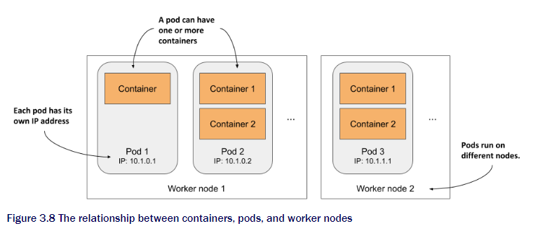
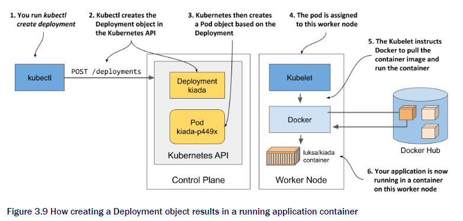

# chapter 3
## 3.1 Deploying kubernetes cluster
Setting up a full-fledged, multi-node kubernetes ain't easy.
Need to know Linux and network administration. Proper Kub install need multiple physical virtual machines and proper network

You can install k8s on laptop, organization infra, or virtual machine from cloud. Nowadays many cloud services provide Kub engine

### 3.1.1
You can start by just using docker desktop to run a single node k8s. Easiest way to start.

This is how the docker desktop runs kubernetes cluster.   


DD sets up a virtual machine hosts the docker daemon and all the container.
In here runs the kubelet.(Kubernetes agents that manages the node)

To access the VM just need the docekr CLI

```shell
$ docker run --net=host --ipc=host --uts=host --pid=host --privileged \   --security-opt=seccomp=unconfined -it --rm -v /:/host alpine chroot /host 
```

Using this command you are in a shell that same as SSH.

Now you can try using [ps aux] to see the running container

### 3.1.2 MiniKube
You can also use Minikube.
This deploy the newer version of Kubernetes than the DD.
- single node
- suitable for testing and developong locally.   

You can check the details from [Minikube repository](http://github.com/kubernetes/minikube)

For windows

<hr />

```shell
New-Item -Path 'c:\' -Name 'minikube' -ItemType Directory -Force
Invoke-WebRequest -OutFile 'c:\minikube\minikube.exe' -Uri 'https://github.com/kubernetes/minikube/releases/latest/download/minikube-windows-amd64.exe' -UseBasicParsing
```
Then add to PATH

```shell
$oldPath = [Environment]::GetEnvironmentVariable('Path', [EnvironmentVariableTarget]::Machine)
if ($oldPath.Split(';') -inotcontains 'C:\minikube'){
  [Environment]::SetEnvironmentVariable('Path', $('{0};C:\minikube' -f $oldPath), [EnvironmentVariableTarget]::Machine)
}
```

To start You simply need
```
minikube start
```

Here is the picture of how Minikube run locally   


### 3.1.3 use *Kind*(Kubernetes in Docker) to run local cluster

Kind runs each cluster node inside a container. Instead of vm or host.
This can create multi-node clusters

Here is system outline   


The process runs in container is running in the host OS. Using kind all Kubernetes components run in Host OS.
This makes it much easier to testing and developing.

Install Kind from [Kind website](https://kind.sigs.k8s.io/docs/user/quick-start/)

Starting a new cluster
```shell
kind create cluster
```

Now you have made the cluster. Lets configurate it to have multiple worker nodes.

This can be done using .yaml file

```yaml
kind: Cluster 
apiVersion: kind.sigs.k8s.io/v1alpha3 
nodes: 
- role: control-plane 
- role: worker 
- role: worker
```

Now the show time Lets make our very first multi-node cluster
```sh
$ kind create cluster --config kind-multi-node.yaml 
```
Check the nodes list by `Kind get nodes`   
To Enter the cluster node `docker exec -it kind-control-plane bash`   

You can also create managed cluster with cloud services. However I will not write about them.

## 3.2 Interacting with Kubernetes

### 3.2.1 setting up kubectl
Now we learn how to use cluster. We need kubectl.
This tool communicates with the Kubernetes API server - Kubernetes Control Plane.   

   

We need to download kubectl [API link: change the version to get latest file](https://storage.googleapis.com/kubernetes-release/release/v1.29.2/bin/windows/amd64/kubectl.exe)

after download Put in PATH.

Kubectl give tab completion to not only command also to object! (wonderful)

### 3.2.3  Using kubectl

Now lets verify that my cluster is working
```sh
$ kubectl cluster-info
Kubernetes control plane is running at https://127.0.0.1:56630
CoreDNS is running at https://127.0.0.1:56630/api/v1/namespaces/kube-system/services/kube-dns:dns/proxy
```   
Now we list the cluster nodes   
```sh
$ kubectl get nodes
kind-control-plane   Ready    control-plane   19m   v1.29.2
kind-worker          Ready    <none>          18m   v1.29.2
kind-worker2         Ready    <none>          18m   v1.29.2
```   
Everything in Kubernetes is reprez as object and can be retrived or manipulated via RESTful API. `kubectl get` command retieves a list of objects from API.   
You can also use `kubectl describe` to get more info.   

### 3.2.4 Interact using web dashboards

Kubernetes gives web dashboard. However this lacks of functionality and lags compare to `kubectl`

In this book there will not use the dashboard but it will help the beginners cause it also teaches how to do the same action in kubectl.   
```sh
$ kubectl apply -f https://raw.githubusercontent.com/kubernetes/dashboard/v2.0.0-rc5/aio/deploy/recommended.yaml
$ kubectl proxy
```

The proxy runs in local as API server allows you to access the services through it.

Now go to this [link to dashboard](http://localhost:8001/api/v1/namespaces/kubernetes-dashboard/services/https:kubernetes-dashboard:/proxy/)

You will see the authentication page run the following command to get the token
```sh
kubectl -n kubernetes-dashboard describe secret $(kubectl -n kubernetes-dashboard 
get secret | sls admin-user | ForEach-Object { $_ -Split '\s+' } | Select -First 1)
```

## 3.3 Running your first application on Kubernetes

### 3.3.1 Running the first Kubernetes application
Finally, We deploy something to cluster. Normally with JSON or YAML but now let's do in easy way.

The imperative way is `kubectl  create  deployment`, this creates _deployment_ object.

Now let's try to deploy the Kiada we made in Chapter 2.

```sh
kubectl create deployment kiada --image=yourId/kiada:0.1
deployment.apps/kiada created
```
- deployment: makes deployment
- kiada: the object will be called kiada
- image: choose the image

Default you pull from docker but you can specify.

After we use the command we created the deployments.   
Try to run `kubectl get deployments`, You might notice this deploy is not yet ready to use.   
Pods is not ready for the deploy. 

To deploy this we need to know about pods.
##### Pods
Pods is group of containers that run together in same worker node share certain Linux namespaces.   


Each pod can think of as a computer. Has different Ip adress, hostname, processes, network interfaces and other resources. You can use `kubectl get pods` to know that we just have deployed a pods.   
This pod is still in pending. Because worker node that has been assigned to must downlad the image before it can run it. When download is complete the pods will enter `Running` state.   
###### just wait for it.   

The inside of deployment is shown below.   

   

After running the kubectl create, will make a new Deploy object by sending the HTTP request to Kubernetes API server. The kubernetes will create new Pod then schedule to worker nodes. Kubelet will aware the new pod that assigned to this node, instructs docker to pull the specified image from registry.

### 3.3.2 Expose to the world

First Easy way will be just using one line of code
```sh
$ kubectl expose deployment kiada --type=LoadBalancer --port 8080 
service/kiada exposed
```
The Create deployment will make the object then expose will create Service object.   
Let's break down
- `expose` : I want to expose the kiada
- `--type=LoadBalancer` : This pod is accessible from outside the cluster via a load balancer
- `--port 8080`: will listen to the port 8080.
- No service name so it will just the same name as Deployment   
For listing service `Kubectl get svc`   
#### Know the Load Balancer
Load Balancer it self is not provided by the kubernetes itself. Instead It is provided by the cloud infrastructure. kubernetes can ask the cloud infrastructure to give the load Balancer and cloud will give the IP address of the load balancer.   

   
In picture would be like this.   

Before provisioning load balancer let's see if the IP address is assigned.
```sh
$ kubectl get svc kiada
NAME        TYPE          CLUSTER-IP    EXTERNAL-IP    PORT(S)         AGE kiada       LoadBalancer  10.19.243.17  35.246.179.22  8080:30838/TCP  82s
```

If you see the external IP means load balancer can now forward request.
You can try to send request by using `curl`

### 3.3.3 horizontally scalling the application
Now the world can see your application. When the request is too high one pod might be not enough for the task.
We need to have more resources. This can be done by using HPA magic. _Scaling out_.
```sh
$ kubectl scale deployment kiada --replicas=3 
deployment.apps/kiada scaled
```
Now you told to make 3 of the replicas. Rest will be done inside the kubernetes and be your desired state.
Kubernetes is able to do what you want by telling them your desired state without giving every single commands.

Let's see if the deploy actually made
```sh
$ kubectl get deploy 
NAME    READY   UP-TO-DATE   AVAILABLE   AGE kiada   3/3     3            3           18m
```
```sh
$ kubectl get pods 
NAME                    READY   STATUS    RESTARTS   AGE 
kiada-9d785b578-58vhc   1/1     Running   0          17s 
kiada-9d785b578-jmnj8   1/1     Running   0          17s 
kiada-9d785b578-p449x   1/1     Running   0          18m 
```
As you see we now have 3 pods.   
You can also use `$ kubectl get pods -o wide` to check the IP and additional information.

Lastly we check which node they are working on. By using `curl`. You might notice that it is saying different pod. The load balancer is working it's magic and distributing the task randomly. let's look at the picture.

   

At the end do not confuse the load balancer. It is provided by the cloud such as GKE.

End of Chapter 3