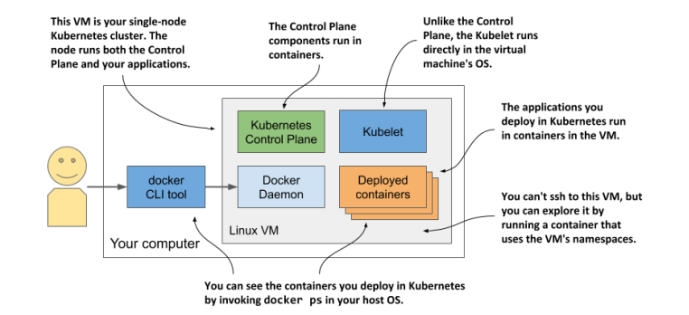

# chapter 3
## 3.1 Deploying kubernetes cluster
Setting up a full-fledged, multi-node kubernetes ain't easy.
Need to know Linux and network administration. Proper Kub install need multiple physical virtual machines and proper network

You can install k8s on laptop, organization infra, or virtual machine from cloud. Nowadays many cloud services provide Kub engine

### 3.1.1
You can start by just using docker desktop to run a single node k8s. Easiest way to start.

