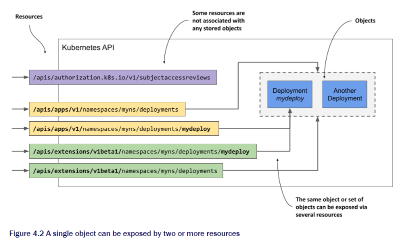
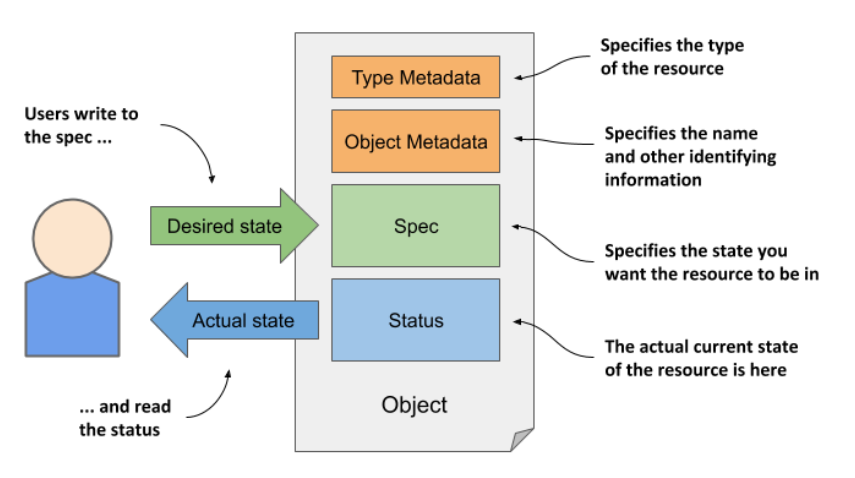
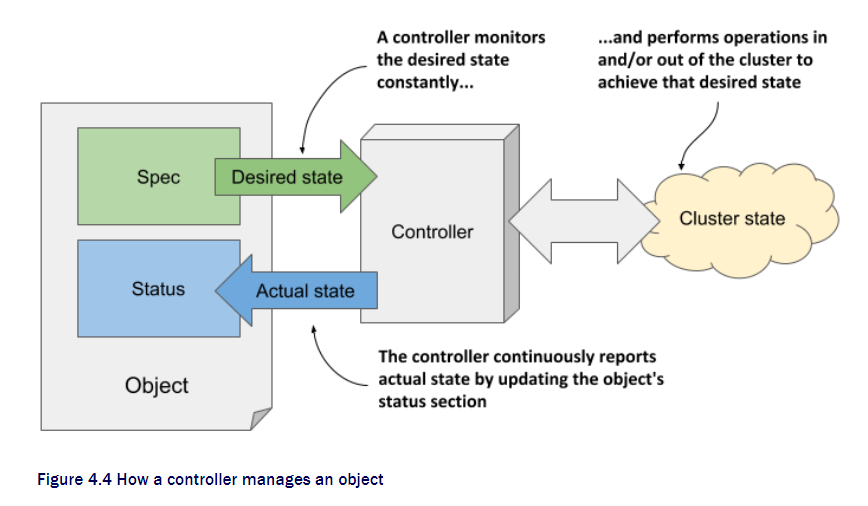
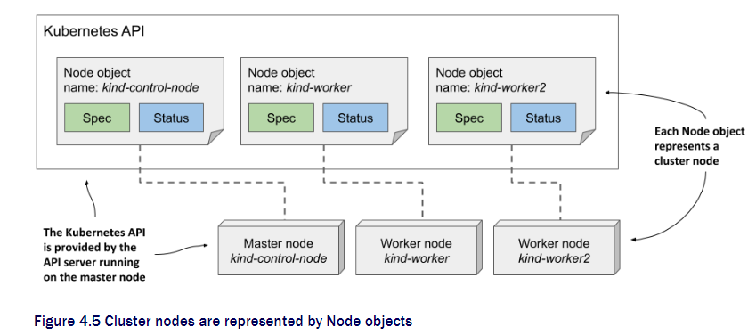

# Chapter 4 Kubernetes API objects

### This chapter is about

- Using API to manage cluster and applications it hosts
- Understanding API object structure
- Retrieving and understanding an object's YAML or JSON manifest
- Inspecting the Status of cluster nodes via Node objects
- Inspecting cluster events through Event objects

We now know the fundamental objects that makes deployed application, How to spawn multiple Pod, Expose them also about load balancer in front.  
Now we will learn about features of Kubernetes objects presented using the exaple of Node and Event objects.

## 4.1 Know the kubernetes API

The configuration of the entire cluster is represented as a object. This include the application running, their config, load balancer, server and storage, security privileges and many. You can find in the next picture.


### 4.1.1 Intro to API

API is the center of the interactio with cluster. Kubernetes API is a HTTP-based RESTful API where state is resources you perform CRUD operations using `POST, GET, PUT, DELETE`.

Key in concept of RESTful API is the resource, Each resource is assigned a Uniform Resource Identifier that identifies it. Eg. In the Kubernetes API, application deployments are reprezed by deployment resources.

All deployments are a resource at `/api/v1/deployments`. When using `GET` to this URI you can get all the resources.  
Each deploy also has it's own resources. Can use GET and PUT to them.  
  
therefore an object can be exposed through multiple resources.

This can mean the instance can be deployed by the first URI and then Read by the second one.  
In some cases the resource might not representing object at all. Example: a authorizing checker. This is why resource is not same as object.

Mostly `GET` call to resources will give back JSON but can be YAML.

### 4.1.2 Structure of an object manifest

Before getting to actually manifest the object let's learn what will be inside the code.

The manifest for most API objects consists of the following four sections.

- Type Metadata
  Type of object, Group it belong, API version
- Object Metadata
  Basic info of object instance. Name, time of creation, owner. Same as long as it's same object
- Spec
  Specifying the desired state. Differ between object type. Pods will know the containers, volumn etc from here
- Status
  Actual State of the object. The condition of pod, status of container, IP address, The node it is running on.



Here is the visual representation.

Now You might have noticed that the most important part of the manifest is that `Spec` and `Status`.  
You write the `Spec` and read the `status`, Then who is doing the other way around.



Inside control plane there will be many controller that manage the objects. Each will control one object type.

It's the controller who read the `Spec`, perform to achieve the desired states and writes the `Stat`.

You use API objects to tell kubernetes what to do and the Kubernetes controller will try to do the work and report back to you using the same language you have used which is the API object.

_Note that not all the object has Spec, Status. The simple ones only carry static data like Event Object is not needed to write them_

## 4.2 Examining an object's individual properties

For examine the object let's use computer in cluster the node.

```sh
kubectl get nodes
NAME                 STATUS   ROLES    AGE    VERSION
kind-control-plane   Ready    master   1h     v1.18.2
kind-worker          Ready    <none>   1h     v1.18.2
kind-worker2         Ready    <none>   1h     v1.18.2
```

Look at the picture below and you will see Each node instance represents on host. In Spec will be config for the host and Stat for status


