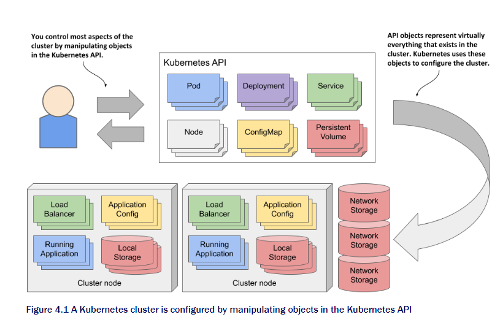

# Chapter 4 Kubernetes API objects

### This chapter is about
- Using API to manage cluster and applications it hosts
- Understanding API object structure
- Retrieving and understanding an object's YAML or JSON manifest
- Inspecting the Status of cluster nodes via Node objects
- Inspecting cluster events through Event objects

We now know the fundamental objects that makes deployed application, How to spawn multiple Pod, Expose them also about load balancer in front.   
Now we will learn about features of Kubernetes objects presented using the exaple of Node and Event objects.

## 4.1 Know the kubernetes API
The configuration of the entire cluster is represented as a object. This include the application running, their config, load balancer, server and storage, security privileges and many. You can find in the next picture.

### 4.1.1 Intro to API
API is the center of the interactio with cluster. Kubernetes API is a HTTP-based RESTful API where state is resources you perform CRUD operations using `POST, GET, PUT, DELETE`.
