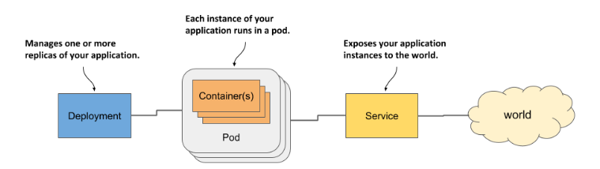
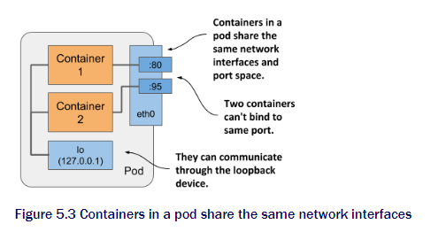
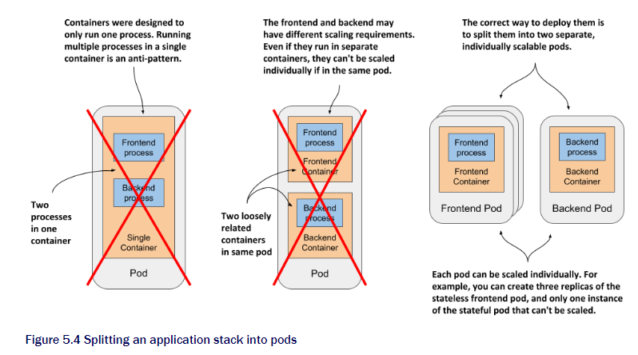
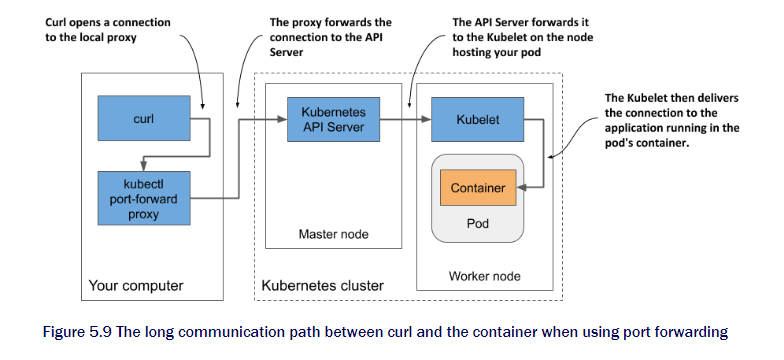

# Running workloads in Pods

In this chapter we will learn about

* when to group container
* Create a pod from yaml file to run application
* Communicate with application
* Adding container to extend main container
* Initialize pod by init containers at pod startup


This is how to deploy minimal application on kubernetes.

From chapter 4 we now know how they are exposed via K8s API. We will now learn specifics of each of them. Let's start with pods. It's most important concept in kubernetes

## 5.1 Understanding pods

We already know that

* container is not deployed by itself to the node, it will be inside a pod.
* Pod can contain multiple container all running on same node.
* Pod cannot be inside multiple node running container on different ones.

### 5.1.1 Why we need pods

Before getting to the point why we need pods let's think about running the multiple processes in one container.

#### why one container should not contain multiple processes

If running multiple processes in one container, It will be impossible to manage.  They will communicate with IPC or shared files. This will require them to run on same computer. It is possible but the log of them will be in one file. Also able to cause problem due to not isolating. Another reason will be the runtime only restarts when the root process dies. It does not care about the child processes. Which that child processes might be in charge of running the system.

#### How a pod combines multiple containers

Since running the multiple process in one container is not possible, we need the pod to put them close when they are related. Also these processes must be able to communicate like they are in the same computer. Pod can give them almost same environments. These processes are isolated but able to share the resources. This allow them to isolate and connected at the same time.



The container will be in the same network interface still having the distinguish aspect of having different port. All the container share the same UTS, able to communicate with IPC. THey also able to use single PID namespace this will allow them to share single process tree. But must hbe specified.

### 5.1.2 Organizing Containers into pods

Pod can be thought as a computer. Typically just run one application. Pods have almost no resource overhead so can create as much as you need. Instead of stuffing all the application in one pod. Should split them into pods.
Here goes an example.

#### Splitting a multi-tier application stack into multiple pods

You have a simple system. One front-end web server and back-end database. It is possible to run them in one computer which is pod. However not the best approach. When you run them in one pod and you have two-node, Since pod can be in only one the other one is just chilling, wasting cpu resources. They can easily communicate so it is best to separate them into two to achieve higher utilization of you hardware.

#### Splitting into multiple pods to enable individual scaling



Front-end and Back-end cannot be using same policy for scaling. When two components in the same system if you need the scaling the pod will be replicated. Now you have two of both components. The Database cannot be replicated since the consistency will be broken. So only front-end should be replicated. Another win for splitting

#### Sidecar containers

This is for giving expansion to existing container application. Called sidecar container.
For example to able the HTTPS protocol for node.js can be done by writing code to original app but more efficient and easy if you just add a reverse proxy to change HTTPS to HTTP. Another example will be using agent to deliver the shared volume. Without changing the original code. This can be done easily by just giving side kicks.

#### Reason for split

* Do these containers have to run on the same host?
* Do I want to manage them as a single unit?
* Do they form a unified whole instead of being independent components?
* Do they have to be scaled together?
* Can a single node meet their combined resource needs?

## 5.2 Create pods from YAML or JSON

In chapter 3 we learned how to create a container by using `kubectl create`. This is easiest way. Normally it is created by using YAML or JSON.
This can be used to define the structure and version control.

### 5.2.1 Creating YAML manifest for pod

We now know how to retrieve and examining the YAML. Now we create it.

Start by creating a file called `pod.kiada.yaml`.

```yaml
apiVersion: v1
kind: Pod
metadata:
  name: kiada
  labels:
    app: kiada
spec:
  containers:
  - name: kiada
    image: jinnkenny99/kiada:latest
    ports:
    - containerPort: 8080
```

Much easier than the one we saw ain't it. This is because many missing fields that the control plane will be fill them when you post and then retrieve.

### 5.2.2  Creating Pods object from the YAML

Now we post the YAML manifest for create.

```sh
kubectl apply -f pod.kiada.yaml
```

### 5.2.3 Checking the pods

As usual the familiar

```sh
kubectl get pod kiada
```

or the one with more info `-o wide` or `kubectl describe`

Lastly can check the events by `kubectl get events`. Not by `describe pod` command is because events are not part of the object itself. It is different one.

## 5.3 Interacting with the application and the pod

Now the application is running. Let's confirm that the application is responding.

### 5.3.1 Sending request to the pod

In chapter 2 we used `kubectl expose` but now we will use different method to approach the pod directly instead of forwarding connections to selected pods.

Each pod is assigned with the own IP so we can get the pod IP address. This is inside the Kube cluster. Not able to get to within your computer.

```sh
kubectl get pod kiada -o wide
NAME    READY   STATUS    RESTARTS   AGE   IP           NODE     ... 
kiada   1/1     Running   0          35m   10.244.2.4   worker2  ... 
```

Now we know that the IP is `10.244.2.4`, We need port for the application.

#### Getting the port number

Very hard to get the port number if you are not the author.
We can specify the list of ports in the pod definition to get easier access.
This has no effect on any thing. But it is good idea so others can know which port each pod exposes. You can also give the names.

We used port 8080 in the pod manifest. So we know already.

#### Connecting to the Pod

Total 3 ways to do it.

* Connect from the worker nodes.
  This can be done because in kube each pod is accessible from any other pod.
  In kind `docker exec -it kind-worker bash`
  When logged in use `curl 10.244.2.4:8080` to access.
  Normally This method is not used/

* Connect using another pod specially for this task
  This is not the perfect method since you can sometimes isolate the pod so it cannot be accessed.

```sh
kubectl run --image=curlimages/curl -it --restart=Never --rm client-pod curl 10.244.2.4:8080 
Kiada version 0.1. Request processed by "kiada". Client IP: ::ffff:10.244.2.5 pod "client-pod" deleted 
```

* Kubectl port forwarding

Easiest way during development will be using `kubectl port-forward`. Through proxy bound to a network port on you local.

```sh
kubectl port-forward kiada 8080
```

Now the connection is made proxy will be waiting for incoming connections
Can now run `curl localhost:8080` to connect to kiada. Here is full view of the proxy and cluster



### 5.3.2 Viewing application log

Node.js application we made log to _stdout_ or _stderr_. This allows the container runtime to intercept and store in consistent location.

We can use kubernetes log system to check the log.

```sh
Kiada - Kubernetes in Action Demo Application 
--------------------------------------------- 
Kiada 0.1 starting... 
Local hostname is kiada 
Listening on port 8080 
Received request for / from ::ffff:10.244.2.1
Received request for / from ::ffff:10.244.2.5
Received request for / from ::ffff:127.0.0.1
```

for real-time streaming

```sh
kubectl logs kiada -f
```

for timestamps

```sh
kubectl logs kiada --timestamps=true #-- is to break the limit of the command length
```

As well as many recent logs. `--since`

For the application that writes the log to a file. We need to copy log and other files from container to our computer also in opposite direction.

### 5.3.3 copying files

the `cp` command almighty.

```sh
kubectl cp kiada:html/index.html /tmp/index.html
```

or the other way around.

### 5.3.4 exec in running container

can just use `exec`

```sh
kubectl exec kiada -- ps aux
```

### 5.3.4 attaching a running container

`kubectl attach` will attach itself to the standard input, output, error streams.

```sh
kubectl attach kiada
```

Now you can see the kiada output when someone curl it.

### 5.3.5 Enable standard input

This is useful when the application is interactive.

```sh
kubectl exec -it kiada -- /bin/bash
```

## 5.4 Adding a sidecar container to a pod

We learned how to run a pod with a single container. Now we will learn how to run a pod with multiple containers. Extending a HTTP to HTTPS.

### 5.4.1 Extending kiada Node.js application using the Envoy proxy

The pod will have two containers. Node.js and Envoy.

Envoy also provide web-based admin interface this might be handy.

### 5.4.2 Adding Envoy to the pod

Create the envoy proxy image first.

For now let's just use the Luksa's image. `docker.io/luksa/kiada-ssl-proxy:0.1`

The pod manifest will be look like this.

```sh
apiVersion: v1
kind: Pod
metadata:
  name: kiada-ssl                 
spec:   
  containers:
    - name: kiada   
      image: luksa/kiada:0.2 
      ports:   
      - name: http     
        containerPort: 8080
    - name: envoy  
      image: luksa/kiada-ssl-proxy:0.1
      ports:
      - name: https
        containerPort: 8443 
      - name: admin                
        containerPort: 9901
```

Now the pod will have two containers.
