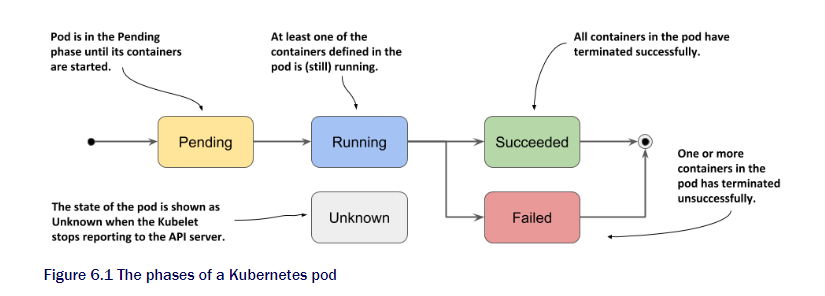
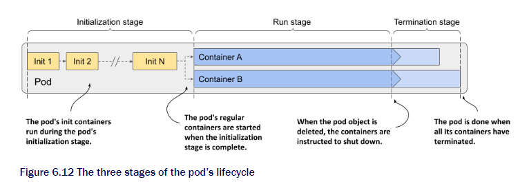
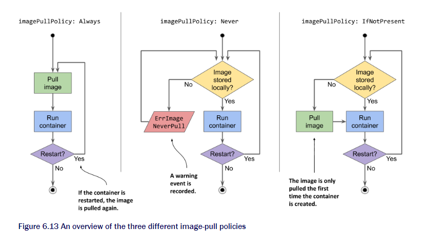
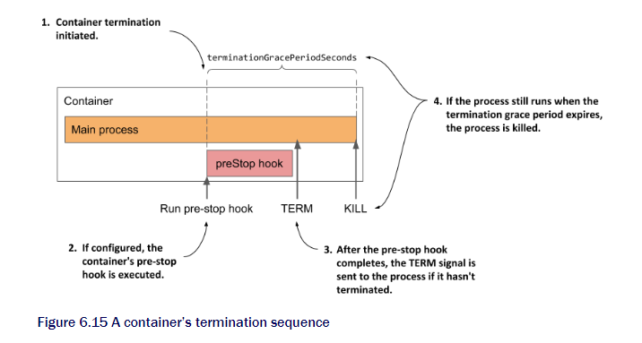

# Chapter 6 Managing the pod lifecycle

## This chapter is about

* Inspecting the pod's status
* Keeping containers healthy using liveness probes
* Using lifecycle hooks to perform actions at container startup and shutdown
* Understanding the complete lifecycle of the pod and its containers

## 6.1 Understanding the pod's status

We have learned how to create and moniter in previous chapters.



### 6.1.1 Pod phase

This is all the phase of pod.

|Phase|Description|
|---|---|
|Pending|initial phase. Until it is schedule to node and image is pulled|
|Running|Least one pod is running|
|Succeeded|It has ended well|
|Failed|Is not configured well at least one failed|
|Unknown|Kubelet nor reporting. Node fail or disconnected internet|

### 6.1.2 Understanding pod conditions

Other than phase pod has condition at the same time. Known at the time of writing.

|pod condition|Description|
|----|----|
|pod schedule|pod has been scheduled to a node|
|Initialized|pod init has completed|
|containersReady|All container in pod is ready|
|Ready|The pod is ready to serve clients|

`kubectl describe po kiada` To check the conditions
`kubectl get po kiada -o json | jq .status.conditions` for more info in JSON

### 6.1.3 State of container

|State|Description|
|---|---|
|waiting|waiting to be started|
|Running|Np|
|Terminated|Ended. May restart|
|Unknown|Dunno|

## 6.2 Keeping containers healthy

This section will be cover how to deal with the dead pod or container.

### 6.2.1 Container auto-restart

The containers inside pod scheduled to node will keep running as long as pod exist.
When the container crushed due to application. then the k8s will restart them.

#### 3 restart policy

|Policy|Description|
|---|---|
|Always|Container restarts even it should end|
|OnFailure|Container is restarted when ending with non-zero code|
|Never|Container never restart|

_This is for all the pod not to each containers._

The time delay for restart will increase exponentially. Up to 5. For each restart gets longer.

### 6.2.2 Liveness probes checking container health

The container can be not responsive without dying. So use probe to check the health. This can be defined to each container.

#### Three Liveness server

* HTTP GET probe
    Ping the container if it give back error restart
* TCP socket probe
    Try to open TCP connection, When not restart
* Exec prob
    Use command line inside the container and checks the exit code

### 6.2.3 Creating HTTP GET liveness probe

```yaml
apiVersion: v1
kind: Pod 
metadata:   
  name: kiada-liveness 
spec:   
  containers:   
  - name: kiada     
  image: luksa/kiada:0.1     
  ports:     
  - name: http       
    containerPort: 8080 
  livenessProbe:    #A       
    httpGet:    #A         
      path: /    #A         
      port: 8080    #A 
  - name: envoy     
  image: luksa/kiada-ssl-proxy:0.1     
  ports:     
  - name: https       
    containerPort: 8443     
  - name: admin       
    containerPort: 9901 
  livenessProbe:      
    httpGet:            
      path: /ready         
      port: admin      
    initialDelaySeconds: 10     
    periodSeconds: 5        
    timeoutSeconds: 2     
    failureThreshold: 3
```

There are two more ways but will not cover in this blog

## 6.3 postStart and preEnd

You can define hooks for the container what to do right after start and before End. You can warmup the server or clear the db just before ending. 

```yaml
apiVersion: v1
kind: Pod 
metadata:   
  name: kiada-lifecycle 
spec:   
  containers:   
  - name: kiada     
  image: luksa/kiada:0.1     
  ports:     
  - name: http       
    containerPort: 8080 
  lifecycle:     
    postStart:       
      exec:         
        command: ["sh", "-c", "echo Hello from the postStart handler > /usr/share/message"]       
    preStop:       
      exec:         
        command: ["sh", "-c", "echo Hello from the preStop handler > /usr/share/message"]
```

## 6.4 Pod lifecycle



* Initialize Stage
|policy|desc|
|---|---|
|not specified|For latest=Always, other=IfnotPresent|
|Always|everytime. If cached then not downlading but registry still|
|Never|Stored locally or used in same node|
|IfnotPresent|Only pulled once|



When having several init container it will be doing sequentially so if the first one fail will restart.

### Run stage

Main container will start then the post-start hook will. This must be successful to actually work.

If the startup or liveness probe fails it will restart.

If the container must stop. The pre-stop will be executed or if not defined sending `term` to give the clue to end gracefully.


