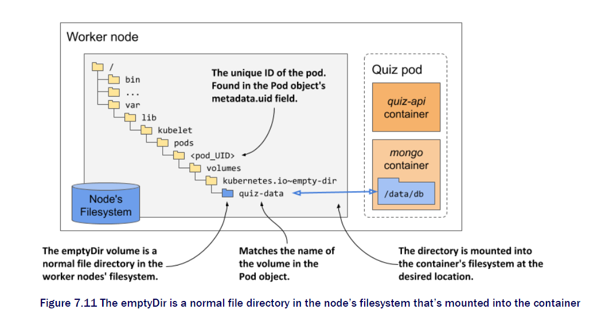
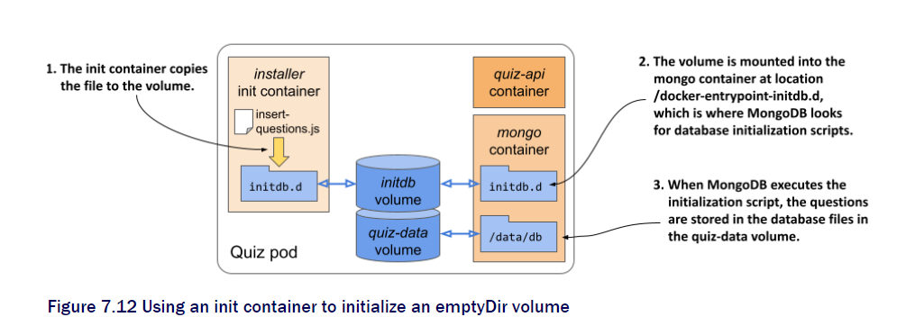
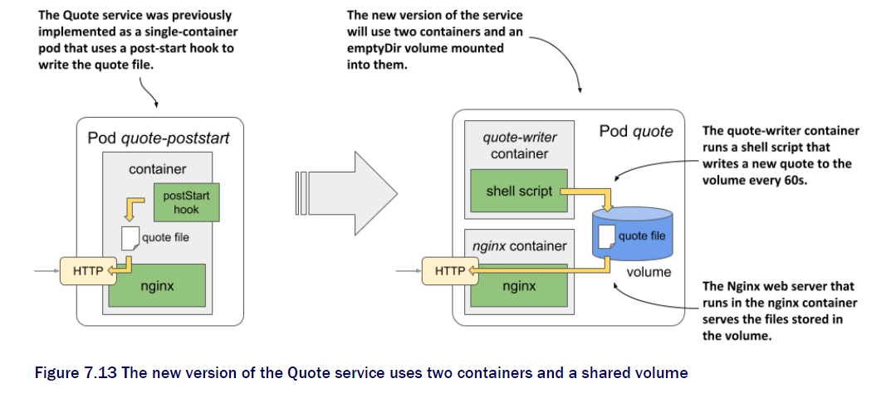

# 7 Attach storage Volumes to pods

## 7.1 Introducing volumes

Pod is like small logical computer. Containers share the computing resources but not file system. Only file in container is only those in the build. When the container stop all files will be gone. To continue from where we dropped off. We need the persist one. Adding the volume to the pod and mounting it into the container.

### How volumes fit into pods

Volumes are component of a pod so they share the same life cycle. Volume defined pod level and can be mounted at the container if desired.

### why we need volume

For example we have mongoDB and the quiz server. when the mongoDB is restarted everything will be gone. we need to add a persist space to store the previous data.

One pod can contain several volumes, The other way around need to be with only one to write and read others with read only. Same issue as caching.

## 7.2 emptyDir volume

Now let's mount the volume to our mongo container. Which will work along with the quiz-api container with in same cell.

```yaml
apiVersion: v1
kind: pod
metadata:
  name: quiz
spec:
  volumes:
  - name: quiz-data
    emptyDir: {}
  containers:   
  - name: quiz-api     
    image: luksa/quiz-api:0.1     
    ports:     
    - name: http       
      containerPort: 8080   
    - name: mongo     
      image: mongo
      volumeMounts:
      - name: quiz-data
        mountPath: /data/db
```

by specifying the volumes in the spec and mount under the mongo we gained persistency.

Regarding `emptyDir` you can use _medium_ and _sizeLimit_ for configuration.

On volume mount you may use

* name
* mount path
* readOnly
* mountPropagation - what to do when another filesystem mounted inside volume
* subPath - when set only `subPath` is mounted into the container
* subPathExpr - like `subPath` but with Env variable

The life span of EmptyDir Volume is connected to pod. Even you shut down the container, This stays same.

Then where this will be inside a node. Or computer.



This is normal directory to the node that mounted inside the pod.

If you want the memory to be located to your pod can just change

```yaml
volumes:
  - name: content
    emptyDir: 
      medium: memory # will use memory so it's much faster but smaller.
```

### Populate the emptyDir

Many way to put initial data when the mongo DB is up. Use MongoDB locally and commit the container state into new image. But this is a lot work. Gitrepo is now gone. Can just use git clone on start but need network.

Just save the data in original image and put in volume when init container runs. As shown below



Run the insert-questions.js to put into initdb volume.

The content of .js file will be

```js
db.getSiblingDB("kiada").questions.insertMany(
  [
    {
      "id": 1,
      "text": "what is kubectl",
    },
    {
      .....
    }
  ]
)
```

in the dockerfile of init-container will have the CMD line for `cp`.

Now with all the feature we have now let's make a `.yaml` file.

```yaml
apiVersion: v1
kind: pod
metadata:
  name: quiz
spec:
  volumes:
  - name: initdb
    emptyDir: {}
  - name: quiz-data
    emptyDir: {}
  initContainers:
  - name: quiz-data
    image: jinnkenny/quiz-initdb-script-installer:latest
    volumeMounts:
    - name: initdb
      mountPath: /initdb.d
  containers:   
  - name: quiz-api     
    image: luksa/quiz-api:0.1     
    ports:     
    - name: http       
      containerPort: 8080   
    - name: mongo     
      image: mongo
      volumeMounts:
      - name: quiz-data
        mountPath: /data/db
      - name: initdb
        mountPath: /docker-entrypoint-initdb.d/
        readOnly: true
```

### Sharing files between containers

Here is the view of the system we will use.



The script container will write the volume with the new quote file and nginx will read the volume to give back http response. Now we will see the yaml file.

```yaml
apiVersion: v1
kind: pod
metadata:
  name: quote
spec:
  volumes:
  - name: shared
    emptyDir: {}
  containers:
  - name: quote-writer
    image: jinnkenny/quote-writer:latest
    volumeMounts:
    - name: shared
      mountPath: /var/local/output
  - name: quote-nginx
    image: nginx:alpine
    volumeMounts:
    - name: shared
      mountPath: /usr/share/nginx/html
      readOnly: true
    ports:
    - name: http
      containerPort: 80
```

the volume 'shared' will be written by writer and only read by the nginx. The path is different because the writer will write on the position and nginx get data from `mountPath: /usr/share/nginx/html`.

### Using external volume

You may use the google storage or others. As network volume. This way the even the pod is down or from other pod the data will be persistant.

simple example.

```yaml
kind: Pod 
spec:   
  volumes:   
  - name: my-volume     
    gcePersistentDisk:       
      pdName: my-volume       
      fsType: ext4  
      readOnly: true
```

### Accessing worker Node filesystem

Not recommended for the db data store. Cause the pod can be on any node. However can use for log system. This is you store the data in the worker node file system. even the pod is down it will remain. however the pod may not be on the same node when rescheduled.

quick example.

```yaml
kind: Pod 
metadata:
  name: node-exp
spec:
  volumes:
  - name: host-root
    hostPath:
      path: /
  containers:
  - name: node-exp
    image: alpine
    command: ["sleep", "999999"]
    volumeMounts:
    - name: host-root
      mountPath: /host
```