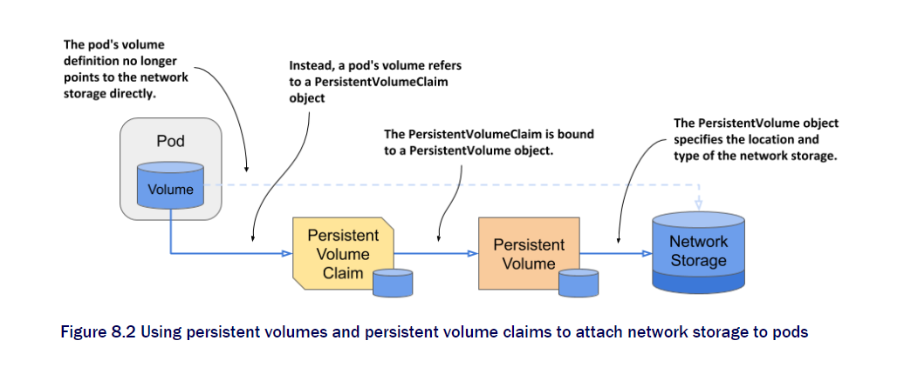
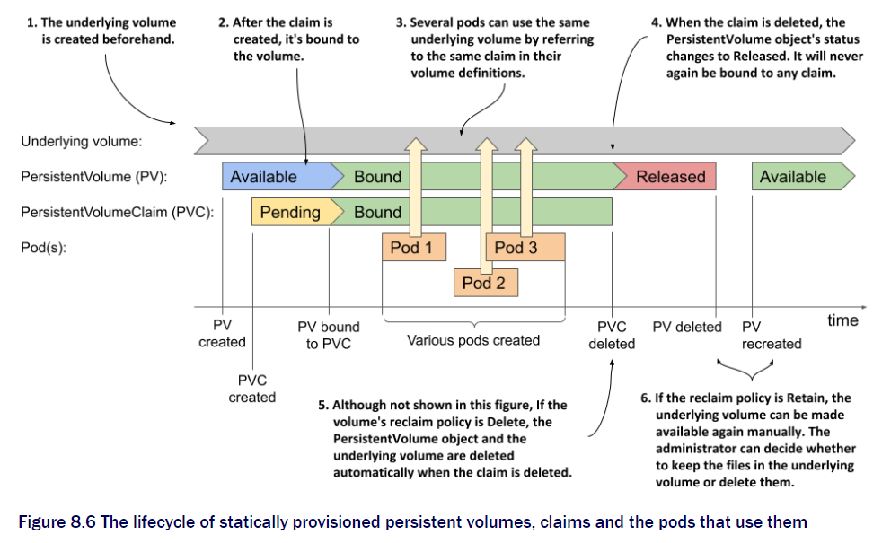
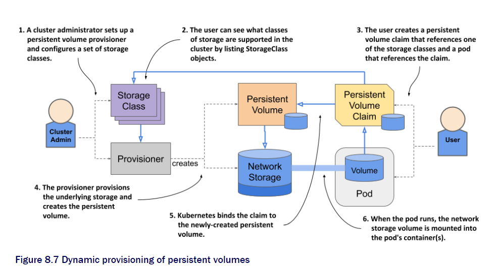

# Chapter 8 Persisting Volume and claims

## Why not just using persisting volume

The developer of the application must specify the google cloud or Amazon cloud persisting volume names. This means the kubernetes is not running on top of the cloud infrastructure instead is bound to it. The application should not care about where this application is deployed. so we use persistant volume with the claim.

### The persisting volume claim



Instead of using the network Storage directly from the pod. You can use claim to direct to the volume. This way you can just use nfs system to point to the claim. You can just add the persistentVolumeClaim object that is bound to the PersistentVolume.

### Make PersistentVolume Object

The cluster admin will set up the PersistentVolume for the developer to use. So we just need to use them.

```yaml
apiVersion: v1
kind: PersistentVolume
metadata:
  name: quiz-data
spec:
  capacity:
    storage: 1Gi
  accessModes:
    - ReadWriteOnce
    - ReadOnlyMany
  hostPath:
    path: /var/quiz-data
```

This is how to create the persistentVolume.

Now we learn how to make claim

### PVC object

```yaml
apiVersion: v1
kind: PersistentVolumeClaim
metadata:
  name: quiz-data
spec:
  resources:
    requests:
      storage: 1Gi
  accessModes:
    - ReadWriteOnce
  storageClassName: ""
  volumeName: quiz-data
```

This way you only need to specify the spec. Without knowing the underlying platform.

Use `kubectl apply` claim object will be bind to the volume.

### Using claim in container

```yaml
spec:
  volumes:
    - name: quiz-data
      persistentVolumeClaim:
      claimName: quiz-data
```

To delete can you `delete` command however the mode will differ to the setting.

### Use claim in multiple pods

You may allow your volume to be shared in the mod of ReadWriteOnce and ReadOnlyMany, But will not allow ReadWriteMany.

Here is overview lifecycle of the persistent volumes.



## Dynamic persistent volumes

So far we have been doing this manually but now we can do better way. With out setting them up one by one will be automated.



### Storage Class Object.

This is like a tag you give to a product. Have already configured so you can use them through the provisioner.

You can use by specifying the class easily and provisioner will bound the claim and volume automatically.

You can create your own class and use them.

This way is much easier to request bigger volume just by sending the same api with different storage. But if ou have a pod who is using the claim then it will be pending. Once you shut them or restart it will update.

### Local persistent volume

You can attach the volume to the node and use them in the pod with claim.

The sequence does not matter because when claim is set and volume is not it will keep pending.

The volume claim that needs local will be always in that node with local class volume and the pod will be scheduled to that node all the time
